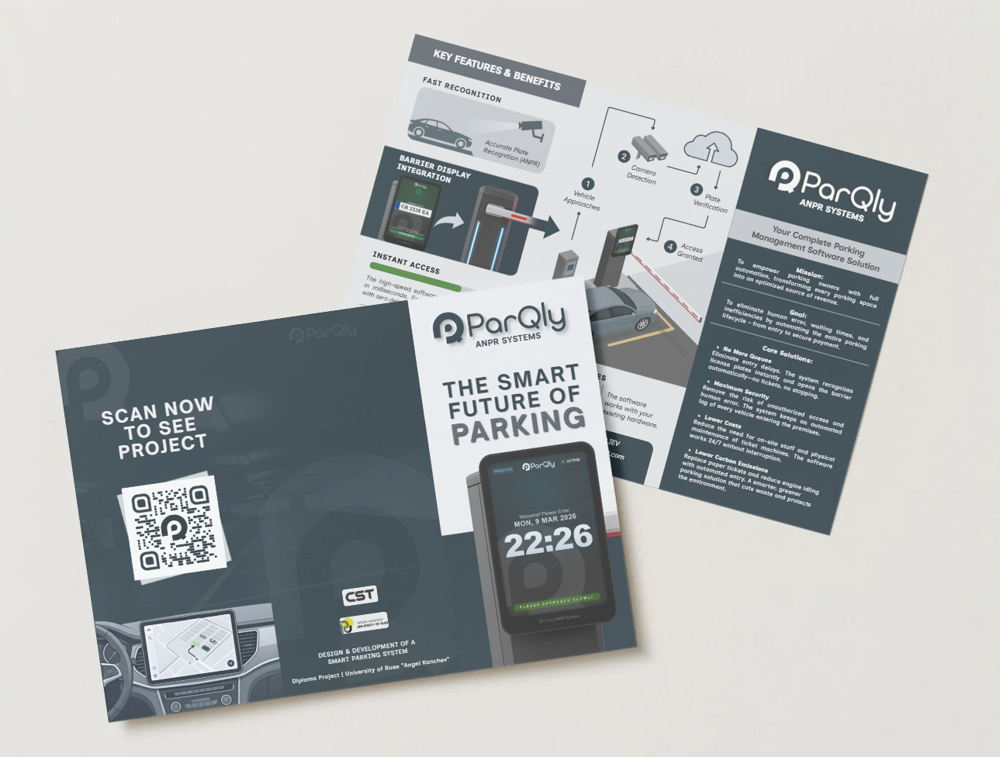
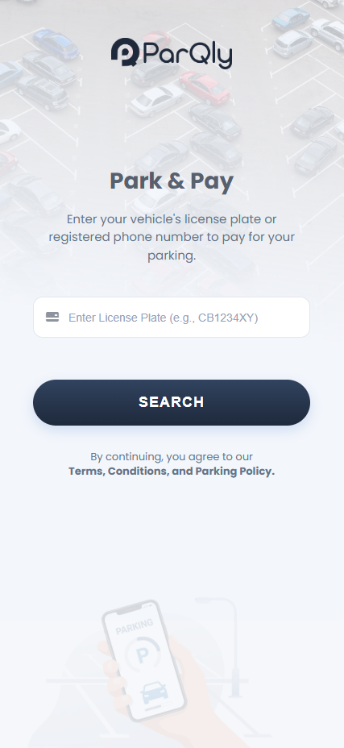
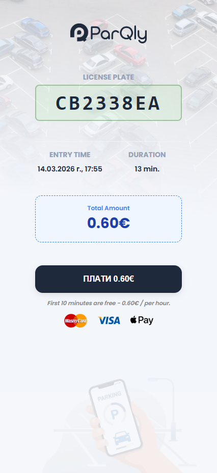
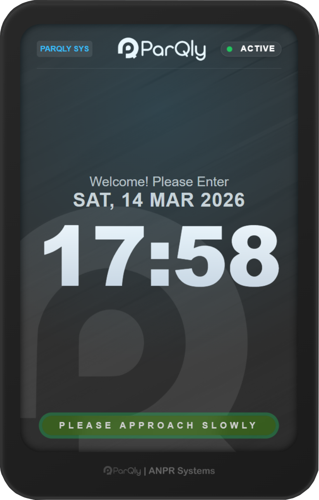
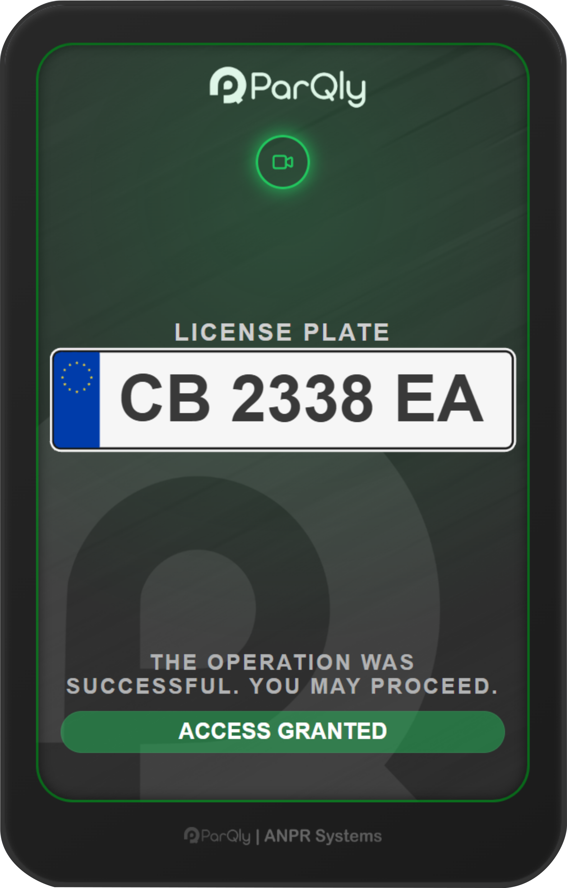

# – The Smart Future of Parking



**Parqly** is a comprehensive software solution for modern parking management. It transforms traditional parking lots into fully automated digital hubs by combining **Computer Vision** (ANPR) with a seamless mobile payment ecosystem.

---

## 🌟 Vision & Goal
Our mission is to empower parking owners with full automation, transforming every parking space into an optimized source of revenue. We eliminate human error, reduce waiting times, and provide a "Park & Pay" experience that is entirely ticketless and frictionless.

---

## System Components

### 1. ANPR Engine (The "Eyes")
A high-performance Python-based module that processes live video feeds.
* **Detection:** Powered by **YOLOv8** to locate license plates in milliseconds.
* **Recognition:** Utilizes **EasyOCR** for precise character extraction.
* **Logic:** Intelligent plate classification and dynamic validation using an array of regex patterns to accurately verify multiple regional formats.

### 2. Smart Payment Web App (The "Wallet")
A mobile-first web application designed for the modern driver.
* **No Apps Required:** Users simply scan a QR code upon entry or exit.
* **Search & Pay:** Drivers enter their license plate to see their real-time balance.
* **Instant Validation:** Once payment is confirmed via the cloud, the exit barrier is granted access immediately.

<p align="center">
  
  
</p>

<p align="center">
  
  
</p>

### 3. Cloud Backend (The "Brain")
* **Flask API:** Acts as the central nervous system, connecting the vision module and the payment site.
* **Supabase (PostgreSQL):** A secure, real-time database that tracks vehicle sessions (Time In/Out), payment status, and security logs.

---

## Key Benefits & Features

| Feature | Description |
| :--- | :--- |
| **Fast Recognition** | High-speed software recognizes plates instantly with zero delays. |
| **Instant Access** | Automated entry/exit for registered or paid vehicles. |
| **Lower Costs** | Eliminates the need for on-site staff and physical ticket machines. |
| **Eco-Friendly** | Reduces engine idling and paper waste from physical tickets. |
| **Maximum Security** | Maintains a digital log of every vehicle with time-stamped entries. |

---

## Workflow Overview

1.  **Vehicle Approaches:** The ANPR camera detects the vehicle and captures the plate.
2.  **Session Created:** A new record is inserted into Supabase with the "IN" status.
3.  **Payment:** The user accesses the **Parqly Web App**, searches for their plate, and pays.
4.  **Access Granted:** Upon exit, the camera recognizes the plate again, verifies the "Paid" status, and triggers the barrier.

---

## 🚀 Getting Started

### Prerequisites
* Python 3.9+
* Webcam or IP Camera
* Supabase Account & Credentials

### Installation
```bash
# Clone the repository
git clone https://github.com/PetarIliev22/Parqly.git

# Install required libraries
pip install -r requirements.txt

# Launch the system
python main.py